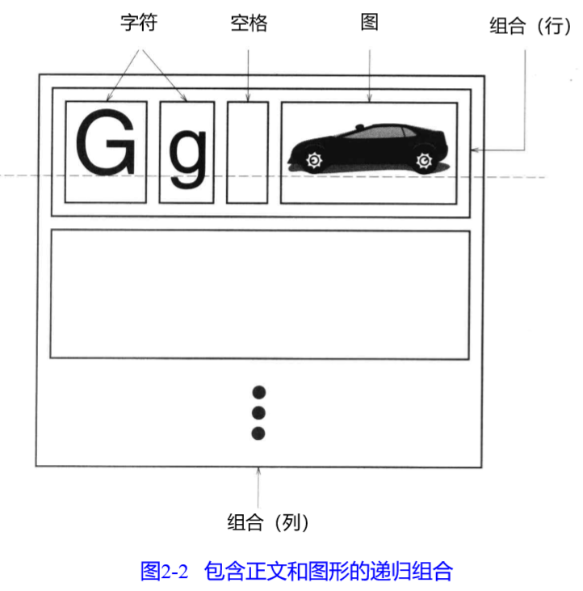
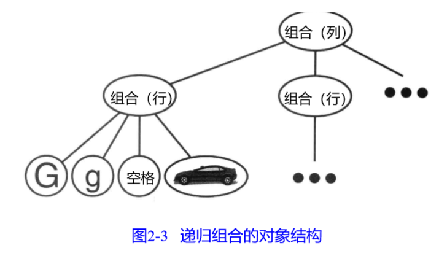

# GOF 设计模式

## 第二章 实例研究：设计一个文档编辑器

**阅读计划：**

p22-p53  30页 计划用时3个小时

**导读：**

* 设计一个Lexi的文档编辑器
* 将获得8个模式的实用经验

### 2.1 设计问题：

**Lexi设计中的7个问题：**

* 文档结构
* 格式化
* 修饰用户界面
* 支持多种视感标准
* 支持多种窗口系统
* 用户操作
* 拼写检查和连字符

### 2.2 文档结构

**内部表示应该支持如下几点:**

* 保持文档的物理结构。即将文本和图形安排到行、列、表等
* 可视化生成和显式文档
* 根据显式位置来隐式文档内部表示的元素
* 一些限制条件：
  * 应该一致对待文本和图形
  * 不该过分强调内部表示中单个元素和元素组之间的差别

#### 2.2.1 递归组合

递归组合：层次结构的表述通常是通过一种递归组合的技术来实现的。

我们将每一个重要元素表示成一个对象，就可用描述这种物理结构，它不仅包括字符、图形等可见元素，也包括不可见的、结构化的元素，如行、列。结果就是如果2-3所示的对象结构

这里隐含了两个重要的地方：

* 对象需要相应的类
* 因为要一致性地对待这些对象，所以这些类必须有兼容的接口

#### 2.2.2 图元

